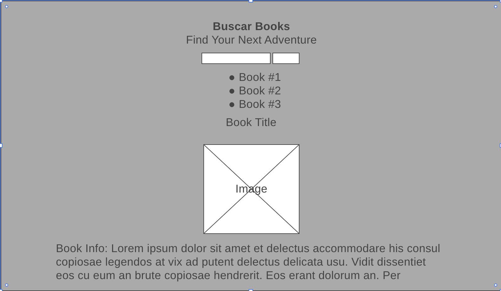
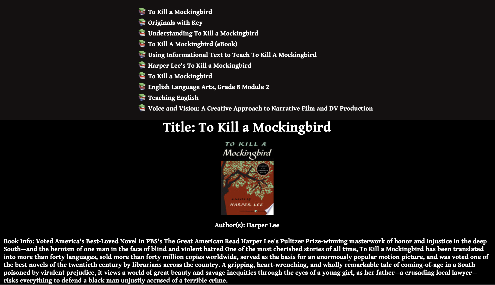

# Buscar Books

A simple web application that displays information about books using the Google Books API.

---

## Technologies Used

* HTML5
* CSS3
* JavaScript
* jQuery
* Google Fonts
* Google Books API

---

## Wireframe

---

## Screenshots of Deployed App

---

## Getting Started

[Click Here](https://amr745.github.io/buscar-books/) to see the deployed app!

---

## Future Enhancements

* A dropdown list instead of static list items

* A show page that holds the returned book information

* Conditional statements that return undefined when no information is available